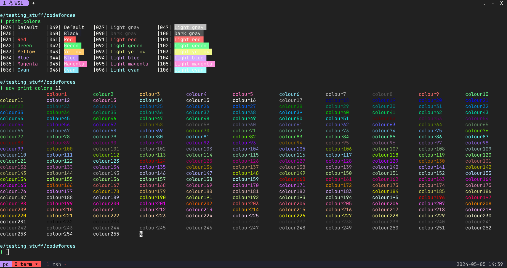
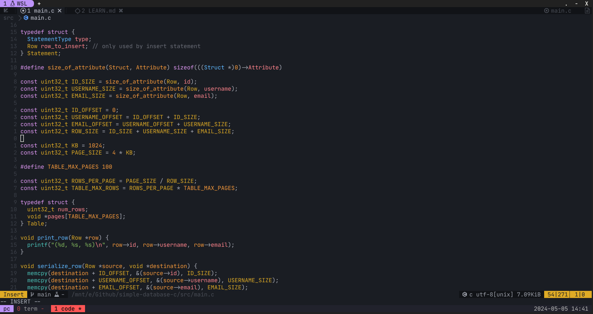
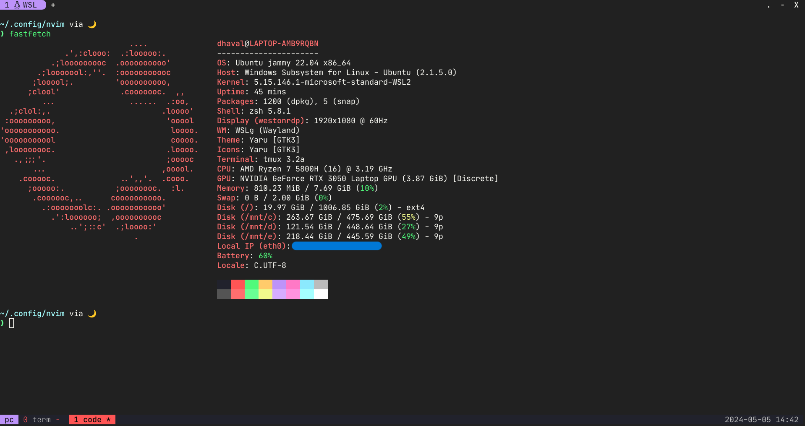

# dotfiles

## Tools
- [tmux](./.tmux.conf)
- [zshrc (starship)](./.zshrc)
- [neovim](./nvim/init.lua)
- [wezterm](./wezterm.lua)
- [alacritty](./alacritty.toml)

## Print Colors

## Neovim

## FastFetch

